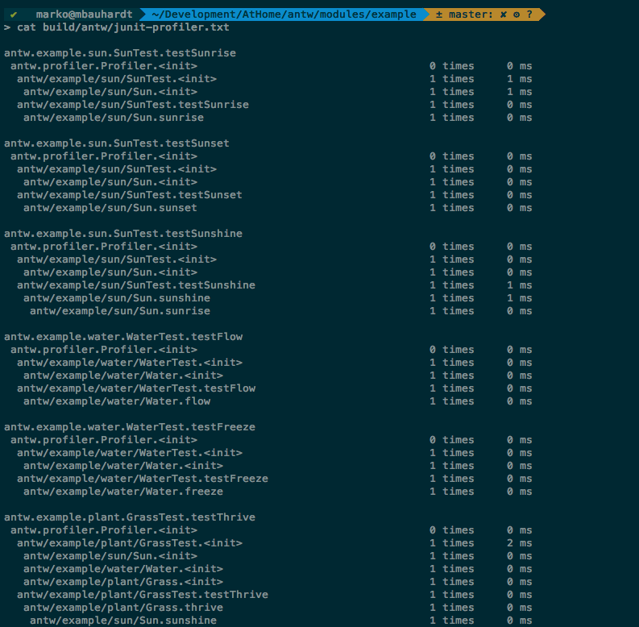




### JunitProfilerLogger
This logger log all messages coming from the antw [junit profiler formatter](/documentation/junit-formatter/junit-profiler-formatter.html) into file *junit_profiler.txt*
This file contains 3 columns. The first column contains a stack of methods which was called. 
The second column describes how often the method was called and the third column shows the duration of the method.

